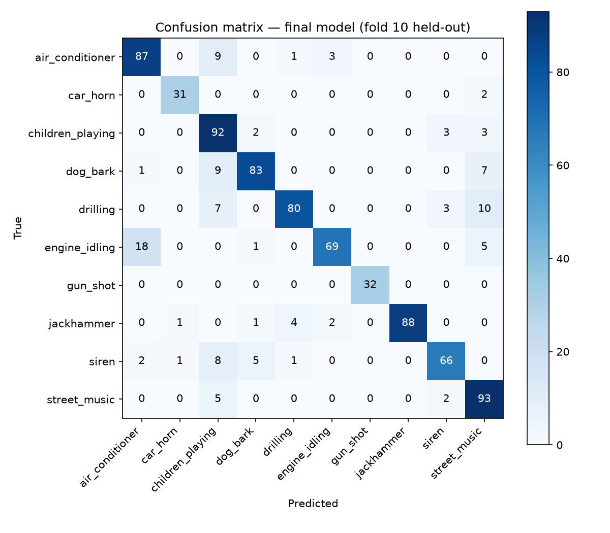

## Baseline model (AudioCNN) — UrbanSound8K, 10-fold CV

| Metric | FP32 |
|--------|------|
| Mean accuracy (10-fold CV) | 0.8192 |
| Macro-F1 (fold 10, final model) | 0.8770 |

### Per-class accuracy (fold 10, final model)
| Class | Acc |
|-------|-----|
| air_conditioner | 0.8700 |
| car_horn | 0.9394 |
| children_playing | 0.9200 |
| dog_bark | 0.8300 |
| drilling | 0.8000 |
| engine_idling | 0.7419 |
| gun_shot | 1.0000 |
| jackhammer | 0.9167 |
| siren | 0.7952 |
| street_music | 0.9300 |

### Accuracy per fold (10-fold CV)
| Fold | Acc |
|------|-----|
| 1 | 0.8041 |
| 2 | 0.8131 |
| 3 | 0.7578 |
| 4 | 0.8293 |
| 5 | 0.9113 |
| 6 | 0.7983 |
| 7 | 0.8317 |
| 8 | 0.7407 |
| 9 | 0.8321 |
| 10 | 0.8734 |

## ONNX export and quantization (Phase 2)

| Model | Format | Size | Accuracy (fold 10) |
|-------|--------|------|---------------------|
| FP32  | ONNX (opset 18) | 36 KB  | 0.8614 |
| INT8  | ONNX (QDQ, per-channel) | 330 KB | 0.8519 |

**Decision: ship FP32 only.** INT8 quantization was implemented and
measured, but made the model ~9x larger (not smaller) and lost 0.96
accuracy points. The model is small enough that quantization overhead
outweighs any storage/speed benefit. See `ADR-0004` for full reasoning.

PyTorch vs ONNX (FP32) parity: verified within `rtol=1e-3, atol=1e-4`
(`test_onnx_parity.py`).